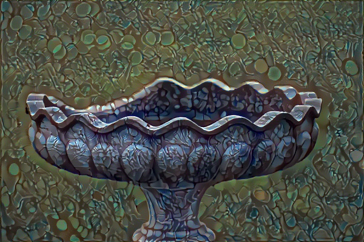

# Ebru-Dataset

Asagidaki repo citation contribution lisans ve kullanim detaylarini vermis ona gore yapabiliriz. 

datanin linkini kolaylik olsun diye veriyorum 
https://drive.google.com/open?id=1ad_Mnv0gIKdR5qerIDo9JRniyadT49yX

https://github.com/colmap/colmap
### About
Novice-Ebru Dataset is ..... The software is licensed under the new BSD license. If you use this dataset for your research, please cite:

===========citation bibtex============
citation will go here
====================================

The paper is available on  (Paper link)

The dataset is available on (Dataset Link)

Download
Executables for Windows and Mac and other resources can be downloaded from https://demuc.de/colmap/. Executables for Linux/Unix/BSD are available at https://repology.org/metapackage/colmap/versions. To build COLMAP from source, please see https://colmap.github.io/install.html.

### Getting Started

After installing anaconda create  environment used in this project using [Ebru Dataset Yaml](/ebru-dataset.yaml)   file. 
This project is created using NVIDIA 1080 GPU, Anaconda 3.6 and Pytorch. 
Please refer to [Pytorch](https://pytorch.org/)  website to setup your environment GPU only.

### Support
Please, use this place to get support (Some google group or email)  for questions and the GitHub issue tracker at (github link of the repo github.com/colmap/colmap ) for bug reports, feature requests/additions, etc.

### Acknowledgments

The Ebrus was created and  the code was written by Aysin Tasdelen (code owner profile link). Funding was provided by Deep Art project manager  Proffessor Sebnem Ozdemir (Sebnem hoca's profile link) and other acknowledgements and .......

### Contribution
Contributions (bug reports, bug fixes, improvements, etc.) are very welcome and should be submitted in the form of new issues and/or pull requests on GitHub.

###License

Licence details

Author: Aysin Tasdelen (aysin dot tasdelen at alumni dot boun dot edu dot tr)