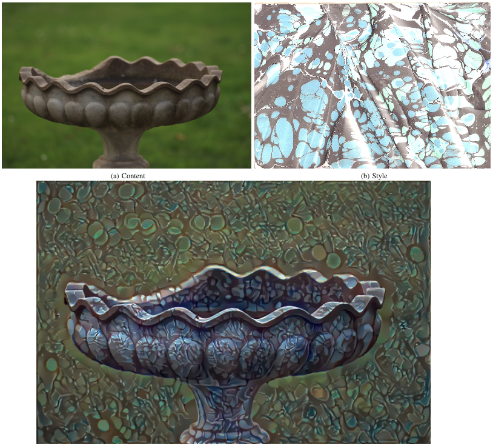

# *Turkish-Ottoman Style Transfer Research: Deep Novice Ebru Dataset*
Ayşin Taşdelen, Eren Bozarık, Can Umay, Yavuz Kömeçoğlu ve Şebnem Özdemir

## Introduction
This repo provides Deep Novice Ebru Dataset for paper - Neural artistic style transfer for Turkish-Ottoman Art Genre. 

**DEEP NOVICE EBRU Dateset** contains 250 different Ebru art samples based on five well-known styles with their distinct attributes:

* **a) Battal Ebru :** In literature, Battal means brave, hero, very big while it is the foundation of all other styles of Ebru. Thus, it is the most important Ebru style. The Ebru artist does not intervene after all the paint scattered from the brush for the first time.

* **b) Gel-Git Ebru :** Gel-git is formed with a bız (a pointing metal tool) drawing lines from left to right and up and down on a Battal ebru. Gel-git is the first style is made using bız .

* **c) Taraklı Ebru :** Vertical or Horizontal Gel-Git ebru is combed in the the other direction with an ebru comb is called Taraklı (Combed) Ebru.

* **d) İstiridye Ebru :** İstiridye (seashell) ebru is a special kind of Tarakli Ebru which has two rows of teeth instead of one.

* **e) İspanyol  Ebru :** The wavy shape of Ispanyol (Spanish) ebru comes from the tecnique used when ebru is transferring to the paper.The paper is moved left and right  up and down when laying the paper on the water and picking it up from the water.


## Examples
Example as a result of the transfer of "İspanyol Ebru" artistic style


Example as a result of the transfer of "Gel-Git Ebru" artistic style


## Getting Started
After installing anaconda create  environment used in this project using [Ebru Dataset Yaml](/ebru-dataset.yaml)   file. 
This project is created using NVIDIA 1080 GPU, Anaconda 3.6 and Pytorch. 
Please refer to [Pytorch](https://pytorch.org/)  website to setup your environment GPU only.

## Downloading Novice Ebru Dateset
Our dataset can be downloaded at [GoogleDrive](#)

## Citing our work and Deep Novice Ebru Dateset
```
@inproceedings{Turkish-Ottoman Style Transfer Research: Deep Novice Ebru Dataset,
    Author = {Ayşin Taşdelen, Eren Bozarık, Can Umay, Yavuz Kömeçoğlu, Şebnem Özdemir},
    Title = {Triggering Diversity of Artificial Intelligence Based Art Research by using Turkish-Ottoman Art Genre},
    Conference = {DATASCI},
    Year = {2018}
}
```
## License
...
